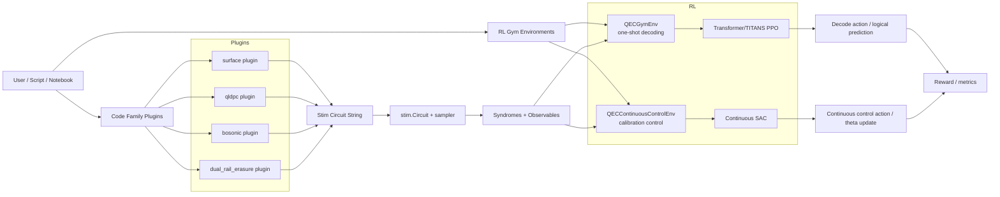

# Syndrome-Net: Quantum Error Correction + RL Control

Syndrome-Net is a research-oriented framework for building, simulating, decoding, and optimizing quantum error-correction (QEC) workflows with Stim. It combines:

- Surface-code and dynamic-code circuit generation
- Plugin-based support for multiple code families (`surface`, `qldpc`, `bosonic`, `dual_rail_erasure`)
- Classical and confidence-aware decoders
- Reinforcement-learning environments and agents for:
  - one-shot decoding (`QECGymEnv`)
  - continuous calibration (`QECContinuousControlEnv`)

## What’s New

- Gym-compatible QEC environments in `surface_code_in_stem/rl_control/gym_env.py`
- SOTA RL agent implementations in `surface_code_in_stem/rl_control/sota_agents.py`
  - Transformer/TITANS-backed PPO for discrete decoding
  - Continuous SAC for calibration control
- End-to-end training script in `scripts/train_sota_rl.py`
- Expanded code-family support:
  - Bosonic variants (`gkp_surface`, `cat_code`, `squeezed_state`)
  - qLDPC parity-matrix builders (toric, surface-derived, hypergraph-product, custom parity)

## Demo Screenshots

These screenshots were captured from the live Streamlit QEC dashboard and are
checked into the repo so GitHub renders them directly:

| Circuit Viewer | Threshold Explorer |
|---|---|
|  |  |

The demo app includes:

- Stim circuit visualization with static SVG and interactive Crumble views
- Detector error graph + syndrome heatmap
- Threshold sweeps with Plotly curves
- Live RL training controls for PPO / SAC runs

## Repository Layout

- `surface_code_in_stem/`: core circuit builders, decoders, RL control, noise models
- `codes/`: plugin architecture and benchmarking harness across code families
- `scripts/`: runnable workflows (including SOTA RL training)
- `tests/`: targeted tests for gym envs, bosonic variants, and qLDPC parity builders
- `surface_code_in_stem/DYNAMIC_CODES.md`: implementation notes mapped to Morvan et al. 2025

## Install

Python 3.10+ is recommended.

```bash
pip install -r requirements.txt
```

Minimal install for RL/Gym experiments:

```bash
pip install stim gym numpy torch pytest
```

## Quickstart

### 1) Generate a surface-code circuit

```python
from surface_code_in_stem.surface_code import surface_code_circuit_string

circuit = surface_code_circuit_string(distance=3, rounds=3, p=0.001)
print(circuit[:500])
```

### 2) Run the new Gym environments

```python
from surface_code_in_stem.rl_control.gym_env import QECGymEnv, QECContinuousControlEnv

decoding_env = QECGymEnv(distance=3, rounds=3, physical_error_rate=0.005)
obs, info = decoding_env.reset(seed=7)

control_env = QECContinuousControlEnv(distance=3, rounds=3, parameter_dim=4)
obs_ctrl, _ = control_env.reset(seed=7)
```

### 3) Train SOTA RL agents

```bash
# Decoder (Transformer/TITANS + PPO)
python3 scripts/train_sota_rl.py --mode ppo --episodes 512

# Calibration (Continuous SAC)
python3 scripts/train_sota_rl.py --mode sac --episodes 512

# Both
python3 scripts/train_sota_rl.py --mode all --episodes 1000
```

### 4) Run tests

```bash
python3 -m pytest tests/test_gym_env.py
python3 -m pytest tests/test_bosonic.py
python3 -m pytest tests/test_qldpc_parity.py
```

## High-Level Architecture



## Documentation

- `docs/README.md`: docs index and reading path
- `docs/RL_QEC_ARCHITECTURE.md`: detailed architecture and algorithm internals with Mermaid diagrams
- `RL_EXPERIMENTS.md`: reproducibility notes
- `surface_code_in_stem/DYNAMIC_CODES.md`: dynamic-code implementation notes

## Notes

- Current RL environments are implemented with `gym`; if desired, migration to `gymnasium` is straightforward.
- `QECGymEnv` is currently a one-step episode formulation for decoding, which is ideal for policy learning over syndrome-to-logical mapping and baseline comparison against MWPM.
