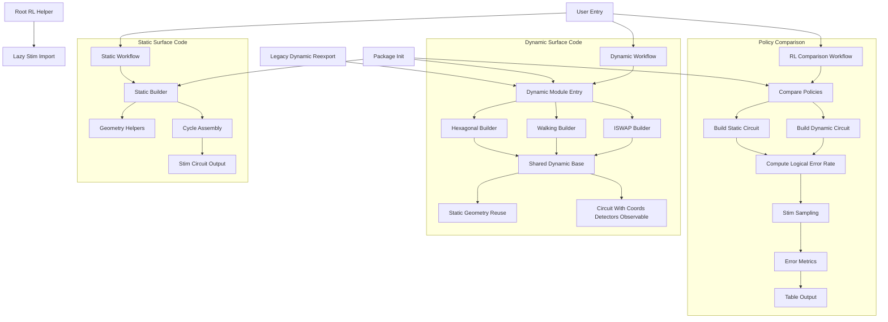

# Quantum Error Correction with Stim

This repository contains implementations and simulations of quantum error correction codes using Stim, including:

- Repetition codes
- Surface codes
- Error threshold analysis

## Structure
- `introduction_to_stim/`: Lab exercises and tutorials for Stim
- `surface_code_in_stem/`: Surface code implementation and simulations
- `surface_code_in_stem/dynamic/`: Stim circuit builders for the hexagonal,
  walking, and iSWAP dynamic surface codes demonstrated in Morvan et al.
  (Nature Physics, 2025). See `surface_code_in_stem/DYNAMIC_CODES.md` for a
  mapping from the paper to the implementation choices here. The legacy
  `dynamic_surface_codes.py` re-exports the same helpers for convenience.
- [getting_started.ipynb](cci:7://file:///home/ryukijano/quantum_error_correction/getting_started.ipynb:0:0-0:0): Introduction to Stim notebook

## Requirements
- Python 3.7+
## Installation
```bash
pip install stim pymatching numpy matplotlib
```

## Reinforcement learning quickstart

The `rl_nested_learning.py` utilities rely on the optional [`stim`](https://github.com/quantumlib/Stim) package for circuit
generation and simulation. Install Stim before running the RL examples:

```bash
pip install stim
```

If Stim is missing, importing `rl_nested_learning` will defer the error until a Stim-powered feature is used, while providing a
clear installation hint so the module remains importable in lightweight environments.

## Project flow diagram

## Project flow references
- Static builder: `surface_code_in_stem.surface_code.surface_code_circuit_string`
- Dynamic builders: `surface_code_in_stem.dynamic.hexagonal_surface_code`, `walking_surface_code`, `iswap_surface_code`
- Shared dynamic components: `surface_code_in_stem.dynamic.base.DynamicLayout`, `StimStringBuilder`, `stabilizer_cycle`
- RL comparison: `surface_code_in_stem.rl_nested_learning.compare_nested_policies`, `_logical_error_rate`, `tabulate_comparison`
- Compatibility modules: `surface_code_in_stem/dynamic_surface_codes.py`, `surface_code_in_stem/__init__.py`, root `rl_nested_learning.py`


