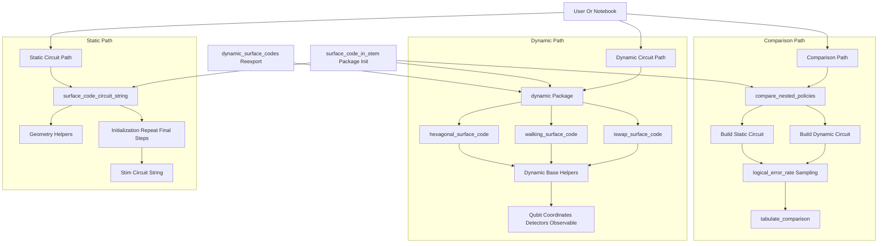

# Quantum Error Correction with Stim

This repository contains implementations and simulations of quantum error correction (QEC) codes using [Stim](https://github.com/quantumlib/Stim), including:

- Repetition code tutorials
- Static surface-code circuit generation
- Dynamic surface-code variants (hexagonal, walking, and iSWAP-native)
- Lightweight RL-style policy comparisons via logical error-rate sampling

## Repository structure

- `introduction_to_stim/`:
  Introductory notebooks and repetition-code exercises.
- `surface_code_in_stem/surface_code.py`:
  Static surface-code circuit generator and lattice utilities.
- `surface_code_in_stem/dynamic/`:
  Dynamic surface-code builders and shared dynamic circuit infrastructure.
- `surface_code_in_stem/rl_nested_learning.py`:
  Utilities to compare static vs dynamic builders by estimated logical error rate.
- `surface_code_in_stem/DYNAMIC_CODES.md`:
  Mapping from Morvan et al. (Nature Physics, 2025) concepts to this implementation.
- `tests/test_rl_nested_learning.py`:
  Determinism and integration checks for policy comparison helpers.
- `RL_EXPERIMENTS.md`, `rl_experiments.py`:
  Notes and deterministic-seed utilities for experiment configuration comparisons.

## Requirements

- Python 3.7+

## Installation

```bash
pip install stim pymatching numpy matplotlib
```

## Quickstart

### 1) Build a static surface-code circuit

```python
from surface_code_in_stem.surface_code import surface_code_circuit_string

stim_circuit = surface_code_circuit_string(distance=3, rounds=3, p=0.001)
print(stim_circuit[:400])
```

### 2) Build dynamic circuits

```python
from surface_code_in_stem.dynamic import (
    hexagonal_surface_code,
    walking_surface_code,
    iswap_surface_code,
)

hex_circuit = hexagonal_surface_code(distance=5, rounds=4, p=0.001)
walk_circuit = walking_surface_code(distance=5, rounds=4, p=0.001)
iswap_circuit = iswap_surface_code(distance=5, rounds=4, p=0.001)
```

### 3) Compare static vs dynamic policy behavior

```python
from surface_code_in_stem.rl_nested_learning import compare_nested_policies
from surface_code_in_stem.dynamic import hexagonal_surface_code

comparison = compare_nested_policies(
    distance=3,
    rounds=3,
    p=0.001,
    shots=128,
    seed=123,
    dynamic_builder=hexagonal_surface_code,
)

print(comparison)
```

## Optional Stim dependency note

The root-level `rl_nested_learning.py` module uses lazy import behavior so repository utilities remain importable even when `stim` is not installed. When Stim-backed features are invoked without Stim present, a clear installation message is raised.

## Project flow diagram



## Project flow references

- Static builder:
  `surface_code_in_stem.surface_code.surface_code_circuit_string`
- Dynamic builders:
  `surface_code_in_stem.dynamic.hexagonal_surface_code`,
  `surface_code_in_stem.dynamic.walking_surface_code`,
  `surface_code_in_stem.dynamic.iswap_surface_code`
- Shared dynamic components:
  `surface_code_in_stem.dynamic.base.DynamicLayout`,
  `surface_code_in_stem.dynamic.base.StimStringBuilder`,
  `surface_code_in_stem.dynamic.base.stabilizer_cycle`
- Comparison helpers:
  `surface_code_in_stem.rl_nested_learning.compare_nested_policies`,
  `surface_code_in_stem.rl_nested_learning.tabulate_comparison`
- Compatibility modules:
  `surface_code_in_stem/dynamic_surface_codes.py`,
  `surface_code_in_stem/__init__.py`,
  `rl_nested_learning.py`
- Deterministic experiment helper:
  `rl_experiments.compare_nested_policies`

## Notebooks

- `introduction_to_stim/getting_started.ipynb`
- `introduction_to_stim/Introduction to Stim Lab.ipynb`
- `surface_code_in_stem/Surface code in Stim.ipynb`
