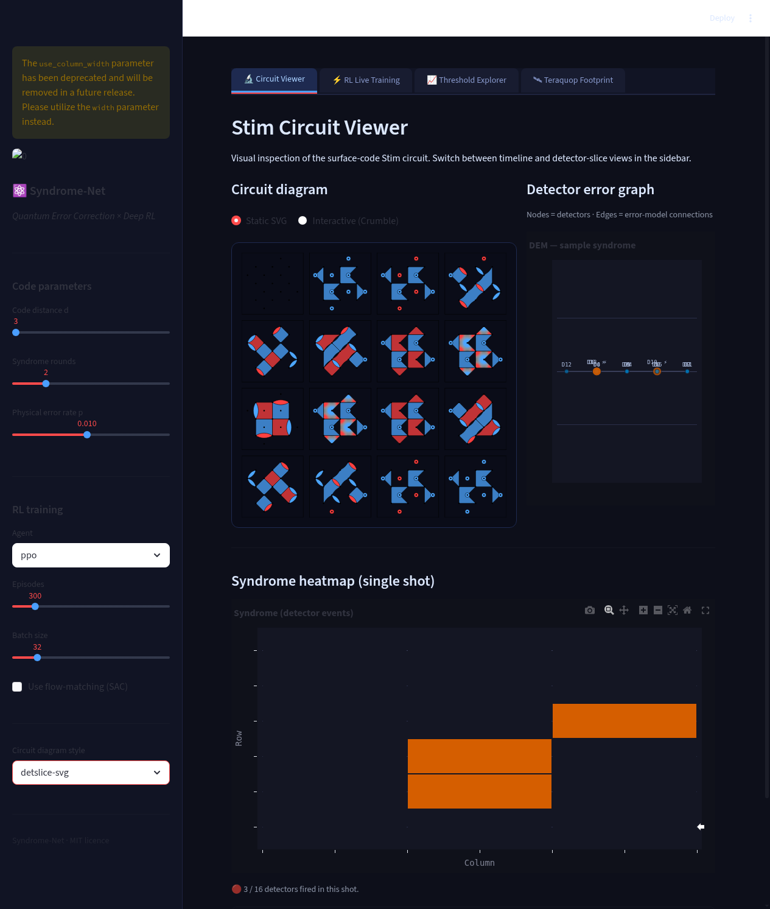
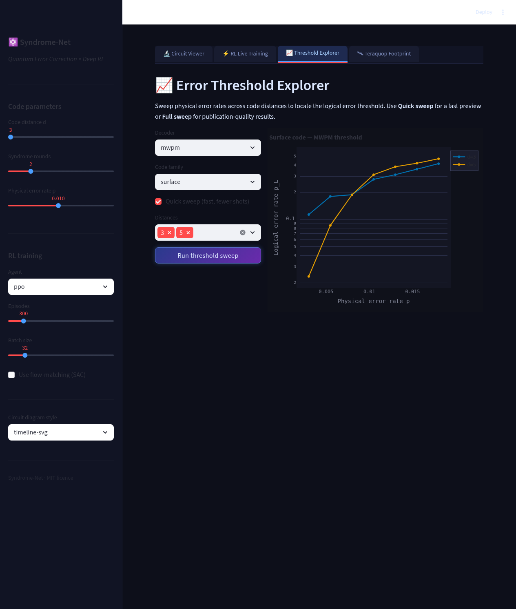
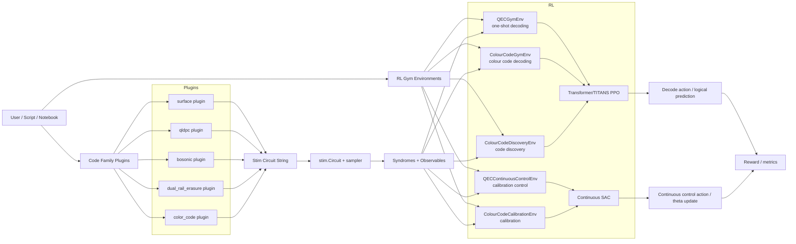

# Syndrome-Net: Quantum Error Correction and Reinforcement Learning Control

Syndrome-Net is a research-oriented framework for building, simulating, decoding, and evaluating QEC workflows with Stim. The project focuses on:

- Surface-code and dynamic-code circuit generation
- **Colour code support** (triangular, rectangular, growing, Loom-based hexagonal)
- Plugin-based support for multiple code families (`surface`, `qldpc`, `bosonic`, `dual_rail_erasure`, `color_code`)
- Classical and confidence-aware decoders
- Reinforcement-learning environments and agents for:
  - one-shot decoding (`QECGymEnv`, `ColourCodeGymEnv`)
  - continuous calibration (`QECContinuousControlEnv`, `ColourCodeCalibrationEnv`)
  - code discovery (`QECCodeDiscoveryEnv`, `ColourCodeDiscoveryEnv`)

## What’s New

- **Colour-code integration** (Lee & Brown 2025, Entropica Loom):
  - `ColorCodeStimBuilder`: triangular, rectangular, growing circuits via color-code-stim
  - `LoomColorCodeBuilder`: hexagonal lattice circuits via el-loom Eka/Block abstractions
  - `ConcatenatedMWPMDecoder`: 6-matching decoder (2 per colour R/G/B)
  - Colour code RL environments (`ColourCodeGymEnv`, `ColourCodeDiscoveryEnv`, `ColourCodeCalibrationEnv`)
  - Parallel threshold estimation with circuit caching (`ParallelColorCodeEstimator`)
  - Hexagonal lattice visualization in Streamlit UI
- Gym-compatible QEC environments in `surface_code_in_stem/rl_control/gym_env.py`
- RL agent implementations in `surface_code_in_stem/rl_control/sota_agents.py`
  - Transformer/TITANS-backed PPO for discrete decoding
  - Continuous SAC for calibration control
- End-to-end training script in `scripts/train_sota_rl.py`
- Expanded code-family support:
  - Bosonic variants (`gkp_surface`, `cat_code`, `squeezed_state`)
  - qLDPC parity-matrix builders (toric, surface-derived, hypergraph-product, custom parity)

## Demo Screenshots

These screenshots were captured from the live Streamlit QEC dashboard and are
checked into the repo so GitHub renders them directly:

| Circuit Viewer | Threshold Explorer |
|---|---|
|  |  |

The demo app includes:

- Stim circuit visualization with static SVG and interactive Crumble views
- Detector error graph + syndrome heatmap
- Threshold sweeps with Plotly curves
- Live RL training controls for PPO / SAC runs
- **🎨 Colour Codes tab**: hexagonal lattice visualization, circuit generation, and RL training

## Repository Layout

- `surface_code_in_stem/`: core circuit builders, decoders, RL control, noise models
- `syndrome_net/`: protocol definitions, circuit builders (including colour codes), decoders, parallel utilities
- `app/`: Streamlit application (circuit viewer, RL training, threshold explorer, colour codes)
- `codes/`: plugin architecture and benchmarking harness across code families
- `scripts/`: runnable workflows (including RL training)
- `tests/`: targeted tests for gym envs, bosonic variants, qLDPC parity, and colour codes
- `surface_code_in_stem/DYNAMIC_CODES.md`: implementation notes mapped to Morvan et al. 2025

## Install

Python 3.10+ is recommended.

### Recommended lock-based install (deterministic)

```bash
pip install -r requirements.lock
```

### Full QEC + colour-code stack

```bash
pip install -r requirements.lock
pip install -r requirements-qec.txt
```

This installs `color-code-stim`, `el-loom`, and `galois` for colour code circuits and concatenated MWPM decoding.

### Streamlit UI-only stack

```bash
pip install -r app/requirements.lock
```

Use this for app-only experiments where CLI benchmark workflows are not required.

## CUDA and accelerated backends

Accelerated sampling backends are optional and discovered at runtime.

- `qhybrid` (`qhybrid_kernels`) — backend probe is exposed through `qhybrid_backend.probe_capability()`
- `cuquantum` (`tensornet`)
- `qujax` (`jax`)
- `cudaq`

Runtime fallback behavior is explicit and instrumented:

- Automatic mode tries candidates in order: `qhybrid -> cuquantum -> qujax -> cudaq -> stim`
- Explicit mode (eg. `sampling_backend="stim"`) pins backend selection
- Any failure in a candidate backend falls back to the next candidate (or to `stim`)
- Every emitted metric row carries backend metadata (`backend_id`, `backend_chain`, `contract_flags`, `profiler_flags`) so users can verify whether acceleration was used

Install matrix guidance:

- Start with `requirements.lock` for baseline reproducible behavior.
- Add optional GPU/runtime dependencies from your platform guide only when enabled in your workflow.
- For CI-like parity, prefer pinned files (`requirements.lock` + `app/requirements.lock`) and keep optional packages optional.

## Quickstart
### 1) Generate a surface-code circuit

```python
from surface_code_in_stem.surface_code import surface_code_circuit_string

circuit = surface_code_circuit_string(distance=3, rounds=3, p=0.001)
print(circuit[:500])
```

### 2) Run the new Gym environments

```python
from surface_code_in_stem.rl_control.gym_env import QECGymEnv, QECContinuousControlEnv
from surface_code_in_stem.rl_control.gym_env import ColourCodeGymEnv

decoding_env = QECGymEnv(distance=3, rounds=3, physical_error_rate=0.005)
obs, info = decoding_env.reset(seed=7)

control_env = QECContinuousControlEnv(distance=3, rounds=3, parameter_dim=4)
obs_ctrl, _ = control_env.reset(seed=7)

# Colour code decoding environment
colour_env = ColourCodeGymEnv(distance=5, rounds=5, physical_error_rate=0.001)
obs_colour, info_colour = colour_env.reset(seed=7)
```

### 2b) Build colour code circuits

```python
from syndrome_net import CircuitSpec
from syndrome_net.codes import ColorCodeStimBuilder, LoomColorCodeBuilder

# Triangular colour code via color-code-stim
spec = CircuitSpec(distance=5, rounds=5, error_probability=0.001, circuit_type="tri")
builder = ColorCodeStimBuilder()
circuit = builder.build(spec)

# Hexagonal colour code via el-loom
spec_loom = CircuitSpec(distance=5, rounds=5, error_probability=0.001)
loom_builder = LoomColorCodeBuilder()
circuit_loom = loom_builder.build(spec_loom)
```

### 3) Train RL agents

```bash
# Decoder (Transformer/TITANS + PPO)
python3 scripts/train_sota_rl.py --mode ppo --episodes 512

# Calibration (Continuous SAC)
python3 scripts/train_sota_rl.py --mode sac --episodes 512

# Both
python3 scripts/train_sota_rl.py --mode all --episodes 1000
```

### 4) Run tests

```bash
python3 -m pytest tests/test_gym_env.py
python3 -m pytest tests/test_bosonic.py
python3 -m pytest tests/test_qldpc_parity.py
python3 -m pytest tests/test_colour_codes.py  # Colour code tests
python3 -m pytest tests/test_circuit_determinism.py  # Includes colour code determinism
```

## Backend and benchmark contract checks

Use these commands to validate backend metadata contracts before sharing artifacts or opening a PR:

```bash
python3 scripts/ci_contract_verification.sh
python3 scripts/benchmark_decoders.py --quick --sampling-backends stim --suite circuit --output-dir artifacts/benchmarks
```

The contract script runs:

```bash
python3 -m pytest tests/test_gym_env.py
python3 -m pytest \
  tests/test_sampling_backend_contracts.py \
  tests/test_benchmark_decoder_contracts.py \
  tests/test_runtime_contracts.py
python3 scripts/bench_runtime_contracts.py --output artifacts/benchmarks/ci_contract_runtime.json
```

## Running benchmark and Streamlit metadata exports

Both the runtime path and benchmark scripts emit backend observability keys that are used by CI and for long-running experiment diffing:

- `backend_id`
- `backend_enabled`
- `backend_chain`
- `backend_chain_tokens`
- `backend_version`
- `contract_flags`
- `profiler_flags`
- `trace_tokens`
- `sample_trace_id`
- `fallback_reason`
- `sample_us`
- `sample_rate`

Use this schema consistently when merging new profiling surfaces.

## Repo merge and repo topology playbook

Current layout intentionally keeps `quantumforge` as an internal dependency directory within this repository, so CI and app code can import optional accelerated kernels without an extra git dependency at runtime.

Recommended workflow for repo-style evolution:

1. Keep `quantumforge/` as the local source-of-truth for Rust/PyO3 acceleration code.
2. When `quantumforge` changes upstream:
   - pull or rebase that component into the vendored directory.
   - run `python3 -m pytest tests/test_*` and at least one `scripts/benchmark_decoders.py --quick ...` smoke sweep.
   - validate `git diff` only touches intended directories.
3. For an explicit split-repository topology:
   - keep `quantumforge` in its own git history.
   - mirror a release window by syncing via `git subtree` or periodic snapshot copy into `syndrome-net/quantumforge`.
   - use a shared lockfile strategy to avoid dependency drift (see `requirements.lock` and `quantumforge/python/requirements.lock`).

See `docs/REPO_MERGE_AND_DEPLOYMENT.md` for a concrete command sequence and recovery checks.

## Benchmarking contract fields

`scripts/benchmark_decoders.py` writes both CSV and JSON rows with explicit backend-trace metadata.
Each row includes:

- `domain`: benchmark family (`circuit` or `qldpc`)
- `family`: code family name (eg. `surface`, `xyz2`)
- `decoder`: decoder identifier
- `distance`
- `physical_error_rate`
- `shots`
- `metric_name`
- `metric_value`
- `backend`
- `backend_enabled`: backend availability/fallback status
- `backend_version`
- `fallback_reason`
- `sample_trace_id`
- `backend_chain`
- `backend_chain_tokens`
- `contract_flags`: e.g. `backend_enabled,contract_met` or `backend_disabled,contract_fallback`
- `profiler_flags`: e.g. `sample_trace_present,trace_chain_recorded`

Use the `--sampling-backends` flag with one or more values (`stim`, `qhybrid`, `cuquantum`, `qujax`, `cudaq`) or sweep aliases (`all`, `sweep`, `all_backends`, `*`) to capture comparable backend metadata in each backend mode.

## High-Level Architecture



## Documentation

- `docs/README.md`: docs index and reading path
- `docs/RL_QEC_ARCHITECTURE.md`: detailed architecture and algorithm internals with Mermaid diagrams
- `RL_EXPERIMENTS.md`: reproducibility notes
- `surface_code_in_stem/DYNAMIC_CODES.md`: dynamic-code implementation notes

## Colour Code References

The colour code implementation is based on:

- **Lee & Brown (2025)**: "High-threshold and low-overhead fault-tolerant quantum memory", [arXiv:2503.09704](https://arxiv.org/abs/2503.09704) — Breakthrough colour code architecture with concatenated MWPM decoding
- **Entropica Loom (2024)**: "Loom: A quantum error correction lattice surgery tool", [arXiv:2404.08663](https://arxiv.org/abs/2404.08663) — Eka/Block/Lattice abstractions for QEC circuit design
- **color-code-stim**: Python package for simulating and decoding colour code circuits using Stim — [GitHub](https://github.com/seokhyung-lee/color-code-stim)

The implementation includes:
- Two circuit builders: `ColorCodeStimBuilder` (color-code-stim) and `LoomColorCodeBuilder` (el-loom)
- Concatenated MWPM decoder with 6 matchings (2 per colour R/G/B)
- RL environments for decoding, discovery, and calibration
- Parallel threshold estimation with circuit caching
- Hexagonal lattice visualization in Streamlit UI

## Notes

- RL environments are implemented with `gymnasium`-compatible wrappers and `gym` compatibility paths.
- `QECGymEnv` is currently a one-step episode formulation for decoding, ideal for policy learning over syndrome-to-logical mapping and baseline comparison against MWPM.
