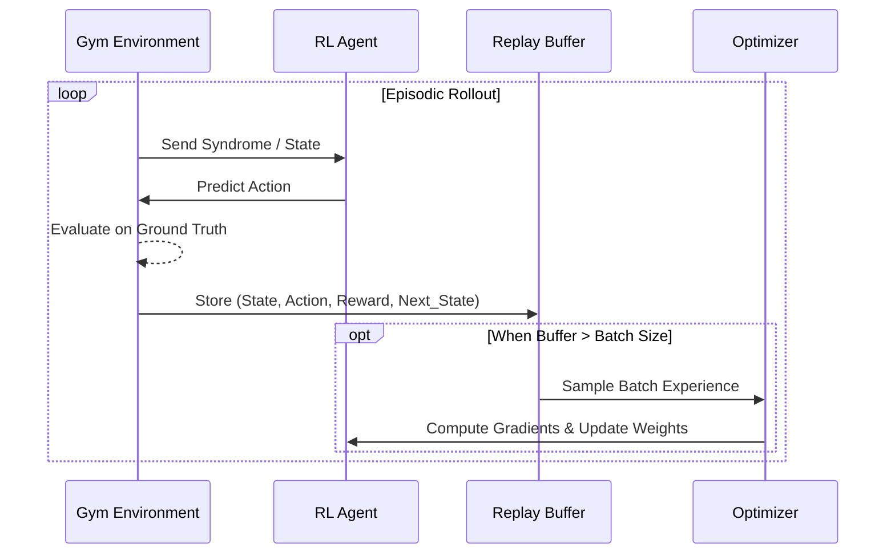

# Syndrome-Net Architecture & RL Internals

This document details the internal architecture, mathematical formulations, and Reinforcement Learning integrations within the Syndrome-Net framework.

## 1. System Components Overview

Syndrome-Net uses a modular pipeline to translate quantum code families into runnable simulation environments and RL abstractions.

```mermaid
classDiagram
    class CodeFamilyPlugin {
        <<Protocol>>
        +generate_circuit_string()
        +get_syndrome_graph()
    }
    
    class QECGymEnv {
        +observation_space: MultiBinary
        +action_space: MultiDiscrete
        +reset() : obs
        +step(action) : (next_obs, reward)
    }

    class RL_Agent {
        <<Interface>>
        +act(obs) : action
        +update(experience)
    }
    
    class StimCalibrationEnvironment {
        +theta: np.ndarray
        +evaluate() : logical_error_rate
    }

    CodeFamilyPlugin --> "stim.Circuit" : compiles to
    "stim.Circuit" --> QECGymEnv : drives
    "stim.Circuit" --> StimCalibrationEnvironment : drives
    QECGymEnv <--> RL_Agent : interacts
```

## 2. Discrete Decoding Environment (`QECGymEnv`)

The discrete decoding task is formulated as a 1-step MDP (one-shot contextual bandit problem).

- **State Space ( $\mathcal{S}$ )**: The binary syndrome vector of length $N$ extracted from the Stim detector sampler.
- **Action Space ( $\mathcal{A}$ )**: A multi-discrete prediction of length $M$ representing the logical observables $L_i \in \{0, 1\}$.
- **Reward ( $R$ )**:
  - $+1.0$ if the predicted logical observable matches the actual simulation observable.
  - $-1.0$ if the prediction is incorrect.

### Transformer-PPO with TITANS Memory

To process highly symmetric and degenerate syndrome graphs, we implement a Transformer-based PPO agent combined with a TITANS neural memory module.

```mermaid
flowchart TD
    S[Syndrome State (1D Array)] --> |Expand| Seq[Sequence Dimension]
    Seq --> T[TITANS Memory Encoder]
    
    subgraph TITANS [TITANS Memory Module]
        ST[Short-term Context]
        LT[Long-term Neural Memory]
        G[Gating Mechanism]
        ST --> G
        LT --> G
    end
    
    T --> TITANS
    TITANS --> C[Context Vector]
    
    C --> A[Actor Network]
    C --> V[Critic Network / Value]
    
    A --> L[Logits]
    L --> |Sigmoid| Probs[Independent Bernoulli Distributions]
    Probs --> Sample[Sample Action]
```

## 3. Continuous Calibration Environment (`QECContinuousControlEnv`)

Hardware calibration requires continuous control over physical parameter perturbations (e.g., tweaking control pulse amplitudes which translate to base error rate changes).

- **State Space**: Continuous detector rate statistics from a batch of $K$ shots.
- **Action Space**: Continuous vector $\theta \in [-0.05, 0.05]^D$.
- **Reward**: $-p_L$ (negative logical error rate).

### Continuous SAC Agent

Soft Actor-Critic (SAC) provides highly sample-efficient continuous control using maximum entropy RL.

```mermaid
flowchart LR
    S[State: Detector Rates] --> P[Policy Network Gaussian]
    P --> |Sample Reparameterized| A[Action: Parameter Shift]
    
    S --> Q1[Twin Q-Network 1]
    A --> Q1
    
    S --> Q2[Twin Q-Network 2]
    A --> Q2
    
    Q1 --> MinQ[min(Q1, Q2)]
    Q2 --> MinQ
    
    MinQ --> U[Update Policy]
    P --> |Entropy Bonus| U
```

## 4. End-to-End Training Flow

The `scripts/train_sota_rl.py` orchestrates the data collection, batching, and optimization of these agents.



## 5. RL loop modes in practice

`app/streamlit_app.py` and `scripts/train_sota_rl.py` share the same strategy
interface for PPO/SAC and emit the same queue-event contract.
The app surface also exposes `pepg` for interactive experiments while script mode
supports `ppo`, `sac`, and `all`.

- `ppo`: one-shot decoding policy on `QECGymEnv`/`ColourCodeGymEnv` with `QECGymEnvBuilder`
- `sac`: continuous calibration policy on `QECContinuousControlEnv`/`ColourCodeCalibrationEnv` with `QECContinuousControlEnvBuilder`
- `pepg`: evolutionary-style continuous tuning loop for control parameters with no explicit replay-buffer requirement

All strategies route through `app/rl_runner.py` event objects (`MetricEvent`,
`SyndromeEvent`, `DoneEvent`, `ErrorEvent`) and are surfaced through
`app/rl_services.py` history normalization.

For advanced RL settings in the UI:

- Curriculum learning gates episode-level difficulty controls on distance and error rate schedules.
- Early stopping settings control reward/success plateau detection windows.
- PPO/SAC/PEPG-specific hyperparameters are passed through directly to their strategy implementations.

## 6. Sampling backend and contract metadata fields

The UI sampling controls and benchmark scripts both expose backend observability in metadata:

- `backend_id`: active backend that resolved sampling for a run (`stim`, `qhybrid`, `cuquantum`, `qujax`, `cudaq`)
- `backend_enabled`: whether the resolved backend could be loaded
- `backend_version`: backend package/version string when available
- `sample_us`: per-call or rolling sample latency in microseconds
- `sample_rate`: empirical sampling rate derived from successful calls
- `sample_trace_id`: short trace identifier for a contiguous sample run
- `trace_tokens`: optional run-level tags from UI input and runtime
- `backend_chain`: resolved backend fallback path used by the probe
- `contract_flags`: explicit reason flags such as `backend_enabled,contract_met` or `backend_disabled,contract_fallback`
- `profiler_flags`: optional profile diagnostics like `sample_trace_present` or `trace_chain_recorded`
- `fallback_reason`: populated if backend selection failed and fallback occurred
- `backend_chain_tokens`: ordered list of attempted backends for provenance
- `details`: free-form environment info payload for extra diagnostics

Documenting these fields consistently across scripts and dashboards makes benchmark
diffing and CI reproducibility checks reliable across machines and runner modes.

## 7. Backend contract schemas

Use a single vocabulary across all code paths to avoid drift:

- `backend_id`: resolved backend for a sample call.
- `backend_enabled`: whether the selected backend could initialize.
- `backend_version`: backend package/module version string.
- `backend_chain`: fallback chain summary.
- `backend_chain_tokens`: ordered tokens for each attempted/selected backend.
- `contract_flags`: reason/status flags used by CI checks.
- `profiler_flags`: trace coverage and telemetry flags.
- `fallback_reason`: populated when fallback to a slower path occurred.
- `sample_trace_id`, `trace_tokens`, `sample_us`, `sample_rate`: run-level diagnostics.

Runtime and benchmark artifacts should include these keys even when values are empty/falsey so parser behavior stays schema-stable.

## 8. Merge pathway for `quantumforge` and acceleration stack

For a controlled merge between this repo and `quantumforge`:

- keep `quantumforge/` in the working tree as the accelerator implementation source.
- preserve public interfaces used by `surface_code_in_stem/accelerators/*`.
- update only lockfiles and accelerator interface modules when synchronizing upstream `quantumforge`.
- run contract-focused tests and compare backend metadata traces after sync:
  - `tests/test_sampling_backend_contracts.py`
  - `tests/test_benchmark_decoder_contracts.py`
  - `tests/test_cuda_q_decoder.py`
  - `scripts/bench_runtime_contracts.py`

For a step-by-step command playbook, see `../docs/REPO_MERGE_AND_DEPLOYMENT.md`.
