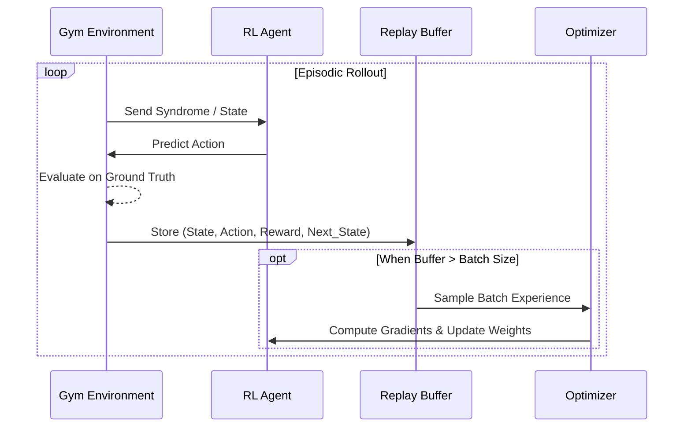

# Syndrome-Net Architecture & RL Internals

This document details the internal architecture, mathematical formulations, and Reinforcement Learning integrations within the Syndrome-Net framework.

## 1. System Components Overview

Syndrome-Net uses a modular pipeline to translate quantum code families into runnable simulation environments and RL abstractions.

```mermaid
classDiagram
    class CodeFamilyPlugin {
        <<Protocol>>
        +generate_circuit_string()
        +get_syndrome_graph()
    }
    
    class QECGymEnv {
        +observation_space: MultiBinary
        +action_space: MultiDiscrete
        +reset() : obs
        +step(action) : (next_obs, reward)
    }

    class RL_Agent {
        <<Interface>>
        +act(obs) : action
        +update(experience)
    }
    
    class StimCalibrationEnvironment {
        +theta: np.ndarray
        +evaluate() : logical_error_rate
    }

    CodeFamilyPlugin --> "stim.Circuit" : compiles to
    "stim.Circuit" --> QECGymEnv : drives
    "stim.Circuit" --> StimCalibrationEnvironment : drives
    QECGymEnv <--> RL_Agent : interacts
```

## 2. Discrete Decoding Environment (`QECGymEnv`)

The discrete decoding task is formulated as a 1-step MDP (one-shot contextual bandit problem).

- **State Space ( $\mathcal{S}$ )**: The binary syndrome vector of length $N$ extracted from the Stim detector sampler.
- **Action Space ( $\mathcal{A}$ )**: A multi-discrete prediction of length $M$ representing the logical observables $L_i \in \{0, 1\}$.
- **Reward ( $R$ )**:
  - $+1.0$ if the predicted logical observable matches the actual simulation observable.
  - $-1.0$ if the prediction is incorrect.

### Transformer-PPO with TITANS Memory

To process highly symmetric and degenerate syndrome graphs, we implement a Transformer-based PPO agent combined with a TITANS neural memory module.

```mermaid
flowchart TD
    S[Syndrome State (1D Array)] --> |Expand| Seq[Sequence Dimension]
    Seq --> T[TITANS Memory Encoder]
    
    subgraph TITANS [TITANS Memory Module]
        ST[Short-term Context]
        LT[Long-term Neural Memory]
        G[Gating Mechanism]
        ST --> G
        LT --> G
    end
    
    T --> TITANS
    TITANS --> C[Context Vector]
    
    C --> A[Actor Network]
    C --> V[Critic Network / Value]
    
    A --> L[Logits]
    L --> |Sigmoid| Probs[Independent Bernoulli Distributions]
    Probs --> Sample[Sample Action]
```

## 3. Continuous Calibration Environment (`QECContinuousControlEnv`)

Hardware calibration requires continuous control over physical parameter perturbations (e.g., tweaking control pulse amplitudes which translate to base error rate changes).

- **State Space**: Continuous detector rate statistics from a batch of $K$ shots.
- **Action Space**: Continuous vector $\theta \in [-0.05, 0.05]^D$.
- **Reward**: $-p_L$ (negative logical error rate).

### Continuous SAC Agent

Soft Actor-Critic (SAC) provides highly sample-efficient continuous control using maximum entropy RL.

```mermaid
flowchart LR
    S[State: Detector Rates] --> P[Policy Network Gaussian]
    P --> |Sample Reparameterized| A[Action: Parameter Shift]
    
    S --> Q1[Twin Q-Network 1]
    A --> Q1
    
    S --> Q2[Twin Q-Network 2]
    A --> Q2
    
    Q1 --> MinQ[min(Q1, Q2)]
    Q2 --> MinQ
    
    MinQ --> U[Update Policy]
    P --> |Entropy Bonus| U
```

## 4. End-to-End Training Flow

The `scripts/train_sota_rl.py` orchestrates the data collection, batching, and optimization of these agents.


