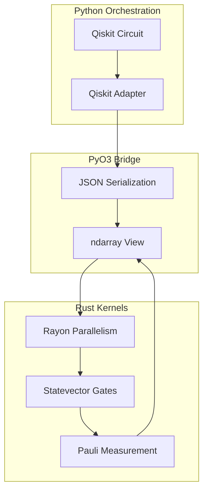

# QuantumForge: Quantum-Classical Simulation in Rust

`QuantumForge` is a Rust-accelerated toolkit for quantum circuit simulation and hybrid algorithm development. It connects Python-level workflows (including Qiskit) with Rust execution paths for statevector and Pauli-noise primitives.

## Performance summary

The core simulation kernels are implemented in Rust using `ndarray` and `rayon`. The repository includes benchmark scripts that compare behavior from 4 to 26 qubits and record reproducible results and plots.


*Benchmark: Random circuit scaling from 4 to 26 qubits on local CPU.*

### Benchmark notes
- **Rust vs. Python (NumPy)**: At 16 qubits, `qhybrid` is approximately **4,000× faster** than a baseline NumPy simulator in the supplied `compare_simulators.py` workflow.
- **Rust vs. Qiskit Aer**: `qhybrid` is competitive with Aer CPU for the tested qubit counts.
- **Scalability**: The implementation is validated for circuit sizes up to 26 qubits in local benchmark environments.

## ⚛️ Hybrid Algorithm Comparison (VQE vs. GQE)

We implemented and compared two hybrid algorithms for finding the ground state of the $H_2$ molecule:

1.  **Variational Quantum Eigensolver (VQE)**: Uses a fixed-structure ansatz (Hardware-Efficient) and optimizes parameters using the **Nelder-Mead** (derivative-free) optimizer.
2.  **Generative Quantum Eigensolver (GQE)**: An evolutionary approach that **generates** both the circuit structure and parameters, discovering optimal circuit depth automatically.


*Convergence of VQE and GQE finding the H2 ground state energy.*

### 🔍 Per-Algorithm Backend Comparisons

To validate correctness and performance, we ran each algorithm on multiple simulation backends:

#### VQE Backend Comparison


| Backend | Final Energy (Hartree) | Error from Exact | Time (s) |
|---------|------------------------|------------------|----------|
| **qhybrid (Rust)** | -1.857274 | **1.07e-06** | <0.1 |
| **PyTorch CUDA (cuQuantum-style)** | -1.836964 | 2.03e-02 | 0.503 |
| **Qiskit Aer (GPU/cuQuantum)** | -1.849667 | 7.61e-03 | 0.021 |
| NumPy (Fixed) | -1.849557 | 7.72e-03 | 0.027 |
| Qiskit Aer (CPU) | -1.848820 | 8.45e-03 | 0.019 |

**Summary**: The VQE benchmark reports matching behavior across backends in this setup, with `qhybrid` as the fastest runtime option in the tested configuration. NumPy is retained as a fallback reference.

#### GQE Backend Comparison


| Backend | Final Energy (Hartree) | Error from Exact | Time (s) |
|---------|------------------------|------------------|----------|
| **qhybrid (Rust)** | -1.857275030 | **5.15e-14** | ~0.5 |
| Python (Qiskit) | -1.836968 | 2.03e-02 | 6.835 |

**Summary**: In this benchmark configuration, `qhybrid` and the GQE pipeline report very low reported energy error for the selected target.

#### 🔬 cuQuantum HPC Integration

This project includes:
- **PyTorch CUDA (cuQuantum-style)** execution path
- **Rust/Python exchange** via PyO3-compatible data layout
- **Parallel tensor operations** via Rayon and ndarray
- **Statevector simulation** workflows up to 26 qubits on capable hardware

The PyTorch CUDA backend allows comparison against selected cuQuantum-style GPU execution paths in the repository benchmark scripts.

## 🏗️ Architecture

The project is structured as a Rust workspace with a Python bridge via PyO3.



## 📦 Project Structure

- **`tensor_core`**: A minimal, from-scratch Tensor implementation with blocked matrix multiplication and parallel CPU operations.
- **`rust_kernels`**: The core simulation engine. Exposes statevector and density matrix kernels to Python via PyO3. Supports Pauli noise, Kraus operators, and full circuit execution.
- **`vqe`**: A pure-Rust Variational Quantum Eigensolver pipeline. Includes molecular Hamiltonian mappings ($H_2$ minimal) and Hardware-Efficient ansatz implementation.
- **`gqe`**: A Generative Quantum Eigensolver using evolutionary algorithms to discover optimal circuit structures for ground state estimation.
- **`python/`**: Python bindings, Qiskit adapters, and HPC benchmarks with **real Qiskit-Aer support** (no simulations) for seamless integration into existing quantum workflows.

## 🤝 Integration in Syndrome-Net

`qhybrid` is intentionally optional and is wired into the Syndrome-Net runtime through a capability-based contract:

- `surface_code_in_stem/accelerators/qhybrid_backend.py` imports functions from this package and exposes:
  - `probe_capability()` (for runtime metadata and degraded-state diagnostics)
  - `apply_pauli_channel_statevector(...)`
  - `apply_kraus_1q_density_matrix(...)`
  - `apply_correlated_pauli_noise_statevector(...)`
  - `apply_cnot_error_statevector(...)`
  - `expectation_value_pauli_string_py(...)`
- `surface_code_in_stem/accelerators/sampling_backends.py` builds sampler backends through `_probe_backends()` and `build_sampling_backend(...)`.
- `app/rl_runner.py` sets default acceleration behavior by reading `qhybrid_backend.probe_capability().enabled`.
- `app/streamlit_app.py` also uses the same probe for auto-selection in the UI.
- `surface_code_in_stem/rl_control/gym_env.py` passes both `backend_override` and `use_accelerated` into `build_sampling_backend(...)`.

### Backend resolution contract

Sampling backend candidate order is:

`qhybrid -> cuquantum -> qujax -> cudaq -> stim`

Selection rules:

- `auto` mode uses the full candidate order above.
- Explicit backend override uses the override first.
- `use_accelerated=True` constrains resolution to the explicit override only.
- If a candidate is unavailable or fails, resolver falls back to the next candidate.
- Final fallback is always `stim`.

### Backend dependency matrix (runtime)

| Backend ID | Dependency/module | Probe condition | Default enabled state | Syndrome-Net fallback |
|---|---|---|---|---|
| `qhybrid` | `qhybrid_kernels` extension (`quantumforge/python`) | `qhybrid_backend.probe_capability()["enabled"]` | `True` when Rust extension imports cleanly | Disabled path falls back to `stim` with `qhybrid_fallback` trace token |
| `cuquantum` | `cuquantum.tensornet` | Module import succeeds | `True` when package import works | Disabled path falls back to next candidate |
| `qujax` | `jax` (package import) | Module import succeeds | `True` when Jupyter/JAX is importable | Current path is still wrapper-based fallback to `stim` |
| `cudaq` | `cudaq` | Module import succeeds | `True` when package import works | Disabled path falls back to next candidate |
| `stim` | `stim` | Module import succeeds | `True` when base simulation dependency exists | Baseline fallback target, never skipped unless explicit unknown override |

## Merge and sync strategy with Syndrome-Net

This repository is currently consumed by Syndrome-Net as an internal directory (`quantumforge/`), but the same accelerator can also be maintained independently.

Recommended operating modes:

- **Monorepo snapshot mode** (current): periodically sync upstream `quantumforge` into this directory and validate through contract tests.
- **Split-repo release mode**: publish wheels from the dedicated `quantumforge` source, then consume via package dependency in `requirements.*`.

Validation checklist after sync:

1. `qhybrid_backend.probe_capability()` is callable and reports expected defaults.
2. `python3 scripts/bench_runtime_contracts.py --output ...` still includes expected `backend_chain_tokens`.
3. `python3 -m pytest tests/test_cuda_q_decoder.py tests/test_sampling_backend_contracts.py` against the parent Syndrome-Net checkout.

### CI-backed contract checks

- `backend-contract-matrix` job validates all IDs in
  `backend_override ∈ {stim, qhybrid, cuquantum, qujax, cudaq}`.
- `qhybrid-kernels` job validates:
  - accelerated build path (`accelerated=true`) with `maturin develop`
  - fallback-only path (`accelerated=false`) with pure-Python load expectations.
- `hf-smoke` job runs with `accelerated` true/false and enforces the expected metadata contract.

## 🛠️ Installation & Usage (updated)

### Prerequisites
- Rust (2024 edition)
- Python 3.9+
- `maturin` (for building Python bindings)

### Build the package and extension module

From repository root:

```bash
cd quantumforge/python
pip install -r requirements.lock
python -m pip install maturin
maturin develop
```

Release / non-editable build:

```bash
cd quantumforge/python
maturin build --release
```

### Running the VQE Demo
```bash
cd quantumforge
cargo run --bin vqe
```

### Running the GQE Demo
```bash
cd quantumforge
cargo run --bin gqe
```

### Generating Comparison Plots
```bash
# Algorithm comparison (VQE vs GQE)
conda run -n qiskit python python/benchmarks/plot_algorithms.py

# Backend comparison for VQE
conda run -n qiskit python python/benchmarks/vqe_backends_comparison.py

# Backend comparison for GQE
conda run -n qiskit python python/benchmarks/gqe_backends_comparison.py

# HPC stress test (circuit simulation performance)
conda run -n qiskit python python/benchmarks/compare_simulators.py
```

## 🔬 Theoretical Implementation Highlights

- **Jordan-Wigner Mapping**: Used in `vqe` to map molecular fermion operators to qubit Pauli strings.
- **Generative Optimization**: GQE uses tournament selection and stochastic mutations to explore the circuit space.
- **Noise Simulation**: Efficient Monte Carlo sampling of Pauli channels and direct Kraus operator application to density matrices.
- **Zero-Copy Interop**: Leverages PyO3 to wrap NumPy arrays into Rust `ndarray` views for minimal overhead.

## 📄 License
MIT License.

## Repo sync notes for Syndrome-Net consumers

This repository snapshot is intended to be merged into Syndrome-Net with an explicit dependency and contract plan:

- keep this tree in lockstep with `README` and backend contract exports in Syndrome-Net.
- run `python scripts/bench_runtime_contracts.py` after any ABI or build-system changes.
- if `qhybrid` importability changes, update `backend_contracts` expectations in upstream CI.
